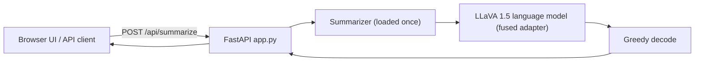

# Deploying the OCR → summary model

Production inference for the trained LoRA adapter (or the fused full model), with a
FastAPI service and a web front-end that doubles as a **dataset & adapter
inspector**. Browse the OCR rows from `output/`, see the reference summary each
page was trained against, and run the adapter live to compare all three side by
side.

```
deploy/
├─ app.py             FastAPI service: web UI + JSON API (loads model + dataset once)
├─ dataset.py         Loads & joins output/ OCR + SUMMARIES CSVs into training pairs
├─ infer.py           Core Summarizer (importable) + CLI + weight introspection
├─ merge_adapter.py   Fuse the LoRA adapter into the base -> standalone model
├─ inspect_weights.py CLI to print/inspect deployed weights
└─ static/index.html  Front-end: dataset browser + 3-way comparison
```

### The interface

- **Left, top:** scrollable, searchable list of **raw OCR rows** (the training pairs).
- **Left, bottom:** the matching **reference summaries** (what the model trained on),
  aligned to the list above.
- **Right:** for the selected row, three stacked panels — **(1)** raw OCR input,
  **(2)** reference summary, **(3)** the adapter's live inference, with latency and a
  word-overlap F1 vs. the reference so you can judge quality at a glance.
- A collapsible **weights inspector** renders per-tensor shape/dtype/mean/std/L2.



---

## Prerequisites

1. **Install deps** (adds FastAPI + uvicorn to the project env):
   ```bash
   ../uv_bootstrap.bat        # or:  uv sync   from the project root
   ```
2. **A trained artifact**, one of:
   - the LoRA adapter at `../training/runs/llava15_lora/final_adapter` (default), or
   - a fused model at `deploy/merged_model` (recommended for production — see below).
   ⚠️ `training/runs/` is **gitignored**, so the adapter does not ship with the
   repo. Copy `final_adapter/` (~20 MB) along when deploying elsewhere.
3. **Base model** `llava-hf/llava-1.5-7b-hf` (~14 GB, public on Hugging Face
   Hub — not something you trained). In adapter mode, `infer.py` explicitly
   fetches it via `huggingface_hub.snapshot_download` into `../training/hf_cache`
   (git-ignored) the first time the server starts, with progress logged to the
   console; later runs are a fast cache check, no re-download. Not needed for a
   fused model (baked in). Requires internet access and ~14 GB free disk on
   first run.
4. **Hardware**: GPU with ~14–16 GB VRAM for fp16. CPU works but is slow.

---

## Recommended: fuse the adapter for production

For "use the whole model with the fused adapter", merge once:

```bash
../.venv/Scripts/python.exe merge_adapter.py --out merged_model
```

This writes a self-contained ~14 GB model to `deploy/merged_model`. From then on
`app.py`, `infer.py`, and `inspect_weights.py` **auto-detect and prefer it** (no
PEFT at runtime, slightly faster). Without it, they fall back to the adapter.

---

## Run the service + front-end

```bash
../.venv/Scripts/python.exe app.py                      # http://127.0.0.1:8008
../.venv/Scripts/python.exe app.py --host 0.0.0.0 --port 9000
# or:  ../.venv/Scripts/python.exe -m uvicorn app:app --port 8008
```

Open **http://127.0.0.1:8008** — pick an OCR row on the left, read its reference
summary, click **Run inference** to see the adapter's output (or tick *auto-run on
select*). The header shows the live model status (mode, params, dtype, device,
VRAM). On startup the server loads the model + dataset once and **prints a model
summary and sample weights** to the console.

The dataset is read from `output/Release_1_OCR.csv` and
`output/Release_1_SUMMARIES.csv` by default; override with the env vars
`DEPLOY_OCR_CSV` / `DEPLOY_SUMMARIES_CSV`.

### JSON API

```bash
# inference on arbitrary OCR text
curl -s -X POST http://127.0.0.1:8008/api/summarize \
     -H "Content-Type: application/json" \
     -d "{\"ocr_text\": \"EONFIDENTIAt (newline) FM AMEMBASSY MOSCOW ...\"}"
# -> {"summary": "This classified report ...", "elapsed_ms": 812.4, "input_chars": 1958}

curl -s http://127.0.0.1:8008/api/health         # {"status":"ok","device":"cuda"}
curl -s http://127.0.0.1:8008/api/model-info      # params, dtype, device, VRAM, mode
curl -s "http://127.0.0.1:8008/api/rows?limit=50" # dataset list (OCR + summary previews)
curl -s http://127.0.0.1:8008/api/row/0           # one pair: full OCR + reference summary
curl -s "http://127.0.0.1:8008/api/weights?filter=q_proj&limit=12"
```

Interactive API docs are served by FastAPI at **/docs**.

> Concurrency: GPU generation is serialized with a lock, so the service handles
> overlapping requests safely (one generation at a time). For higher throughput,
> run multiple workers/replicas behind a proxy. Bind to localhost and add a
> reverse proxy + auth before exposing it publicly.

---

## Inspect the weights

When deploying you can print and inspect the live weights three ways:

- **On startup** — `app.py` calls `print_summary()` automatically.
- **CLI** — `../.venv/Scripts/python.exe inspect_weights.py --filter q_proj --limit 20`
  (use `--filter lora_` to see the adapter deltas in adapter mode).
- **HTTP** — `GET /api/weights?filter=<name>&limit=<n>` returns each tensor's
  shape, dtype, numel, mean, std, and L2 norm.

`infer.py --inspect` also prints the summary before running a one-off generation.

---

## Use it from your own Python code

```python
from infer import Summarizer, resolve_source

summarizer = Summarizer(**resolve_source())   # fused if present, else adapter
print(summarizer.summarize("EONFIDENTIAt (newline) FM AMEMBASSY MOSCOW ..."))
print(summarizer.model_info())
```

Build the `Summarizer` once and reuse it — loading is the slow part.

---

## Good to know

- **Input format:** feed OCR exactly as your pipeline emits it (keep the
  `(newline)` markers and garbled spellings — that's the training distribution).
- **Long pages** are auto-truncated head + tail to fit the token budget.
- **Deterministic:** greedy decoding (`do_sample=False`) → same input, same output.
- **Text only:** the page image is not used; you don't need the PNGs at inference.
- **Quality ceiling:** reference summaries were generated by gemma (via Ollama), so
  this model reproduces that style — spot-check important outputs for faithfulness.
- **Keep inference matched to training:** `INSTRUCTION`, `max_length=2048`, and the
  head+tail truncation in `infer.py` mirror the trainer; changing them hurts quality.
