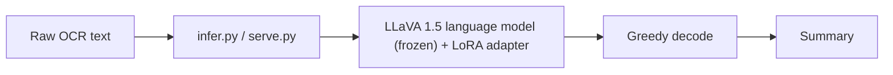

# Deploying the OCR → summary adapter

Real-world inference for the trained LoRA adapter. Give it the **raw OCR text**
of a document page (the same noisy form your pipeline produces, e.g.
`EONFIDENTIAt (newline) FM AMEMBASSY ...`), get back a **one-paragraph summary**.

This folder is independent of `training/` — you can ship it on its own as long as
you also bring the trained adapter and the model cache (see Prerequisites).



---

## Prerequisites

1. **Environment** — the project venv (created by `../uv_bootstrap.bat`). Same deps
   as training: `torch`, `transformers`, `peft`, `sentencepiece`, `accelerate`.
2. **The trained adapter.** Default location:
   `../training/runs/llava15_lora/final_adapter`.
   ⚠️ `training/runs/` is **gitignored**, so the adapter does **not** travel with
   the repo. To deploy elsewhere, copy that `final_adapter/` folder along (it is
   only ~20 MB) and point `--adapter-dir` at it.
3. **Base model.** `llava-hf/llava-1.5-7b-hf` (~14 GB). Auto-downloaded on first
   run into `../training/hf_cache`. The adapter alone is useless without it.
4. **Hardware.** GPU with ~14–16 GB VRAM for fp16 (recommended). CPU works but is
   very slow (minutes per page) — fine for occasional use, not for serving.

---

## Option A — one-off from the command line

```bash
# from deploy/
../.venv/Scripts/python.exe infer.py --text "EONFIDENTIAt (newline) FM AMEMBASSY MOSCOW ..."
```

From a file (best for long/noisy pages — paste the OCR into a `.txt` first):

```bash
../.venv/Scripts/python.exe infer.py --text-file page.txt
```

From stdin (pipe):

```bash
echo "EONFIDENTIAt (newline) FM AMEMBASSY MOSCOW ..." | ../.venv/Scripts/python.exe infer.py --text-file -
```

## Option B — interactive (paste pages, get summaries)

```bash
../.venv/Scripts/python.exe infer.py
# OCR> <paste one OCR page, press Enter>
# === Summary === ...
# OCR> quit
```

The model loads once and stays resident, so each subsequent page is fast.

## Option C — HTTP microservice (integrate into an app)

Start it (model loads once at startup):

```bash
../.venv/Scripts/python.exe serve.py --host 127.0.0.1 --port 8008
```

Call it from anything:

```bash
curl -s -X POST http://127.0.0.1:8008/summarize \
     -H "Content-Type: application/json" \
     -d "{\"ocr_text\": \"EONFIDENTIAt (newline) FM AMEMBASSY MOSCOW ...\"}"
# -> {"summary": "This classified report ..."}

curl -s http://127.0.0.1:8008/health
# -> {"status": "ok", "device": "cuda"}
```

Stdlib only (no FastAPI/Flask). It binds to localhost by default — put it behind a
real reverse proxy / auth before exposing it.

## Option D — standalone merged model (no PEFT at runtime)

Bake the adapter into the base weights for a portable, dependency-light artifact:

```bash
../.venv/Scripts/python.exe merge_adapter.py --out merged_model
../.venv/Scripts/python.exe infer.py  --merged-model merged_model --text-file page.txt
../.venv/Scripts/python.exe serve.py  --merged-model merged_model
```

Trade-off: the merged model is the full ~14 GB fp16 LLaVA on disk (vs. the ~20 MB
adapter), but it loads a little faster and needs no `peft` at inference time.

---

## Use it from your own Python code

```python
from infer import Summarizer          # run from deploy/, or add deploy/ to sys.path

summarizer = Summarizer()             # loads base + adapter once
text = "EONFIDENTIAt (newline) FM AMEMBASSY MOSCOW ..."
print(summarizer.summarize(text))     # -> one-paragraph summary
```

Construct `Summarizer(...)` once and reuse it for many pages — loading the model
is the slow part; `summarize()` is cheap.

---

## Good to know

- **Input format:** feed the OCR exactly as your pipeline emits it — the noisy
  `(newline)` markers and garbled `CONFIDENTIAL` spellings are what the model was
  trained on, so leave them in.
- **Long pages are handled:** OCR longer than the token budget is truncated
  head + tail automatically; nothing errors on oversized input.
- **Deterministic:** decoding is greedy (`do_sample=False`), so the same input
  gives the same summary every run.
- **Text only:** the page image is not used — only the OCR text. You do **not**
  need the PNGs at inference time.
- **Quality ceiling:** the reference summaries used for training were generated by
  another model (gemma via Ollama), so this adapter reproduces that summarization
  style. Spot-check important outputs for faithfulness; summarizers can hallucinate
  on very noisy OCR.
- **Keep inference settings matched to training:** `INSTRUCTION`, `--max-length`
  (2048), and the head+tail truncation in `infer.py` mirror the trainer. Changing
  the instruction wording will degrade quality.
