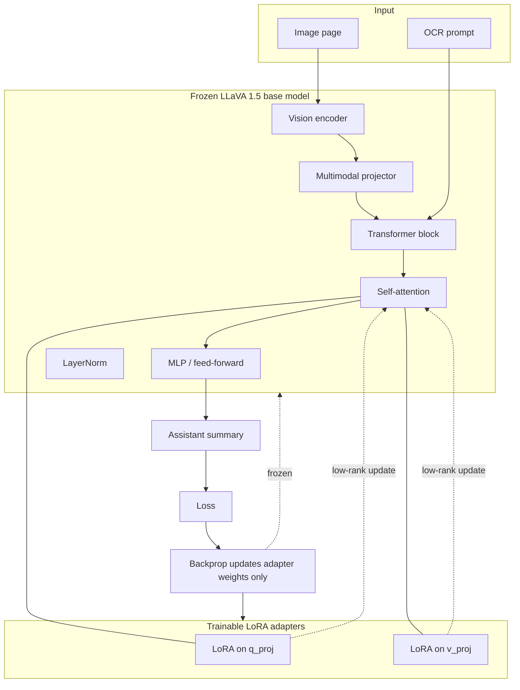

# LLaVA 1.5 7B LoRA training

Model: `llava-hf/llava-1.5-7b-hf`  
Data: `../output/` CSVs + `../<dataset>_PNG/` images  
All downloads, cache, checkpoints, and adapters stay in `training/`.

### 1) Install deps (once)

```bash
../uv_bootstrap.bat
```

This installs project dependencies (including `transformers`, `peft`, `accelerate`, `sentencepiece`) through `uv sync`.

### 2) Build JSONL dataset

```bash
../.venv/Scripts/python.exe build_llava15_dataset.py --root ..
```

Output: `data/llava15_train.jsonl` with fields: `image_path`, `prompt`, `summary`.

### 3) Evaluated test (must pass before full run)

```bash
../.venv/Scripts/python.exe train_llava15_lora_smoke.py --max-samples 256
```

Expected: train loss decreases and `eval_loss` is numeric (not `nan`).

### Training View

The code trains a frozen LLaVA 1.5 base model with LoRA adapters attached to the attention projections (`q_proj` and `v_proj`). Only the adapter weights update during backpropagation; the base model weights stay fixed.



### 4) Full training with checkpoints

```bash
../.venv/Scripts/python.exe train_llava15_lora.py --num-epochs 2
```

Resume for one more epoch:

```bash
../.venv/Scripts/python.exe train_llava15_lora.py --output-dir runs/llava15_lora --resume-from-checkpoint last --extra-epochs 1
```

Fresh one-epoch run:

```bash
../.venv/Scripts/python.exe train_llava15_lora.py --num-epochs 1 --output-dir runs/llava15_lora
```

Checkpoint files are written under `runs/llava15_lora/`, including `latest_checkpoint.txt`, `resume_command.txt`, and `final_adapter/`.
