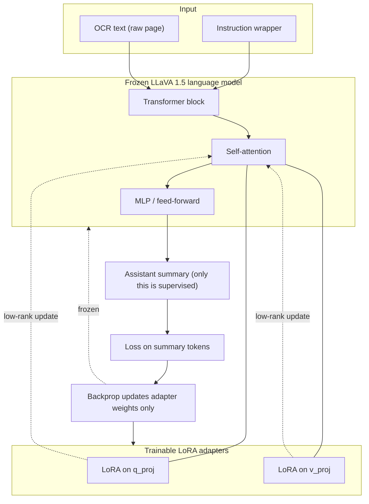

# LLaVA 1.5 7B LoRA training (text-only OCR → summary)

Model: `llava-hf/llava-1.5-7b-hf` (LoRA on the language backbone)
Data: OCR text + reference summaries from `../output/` CSVs
All downloads, cache, checkpoints, and adapters stay in `training/`.

**Task:** given the raw OCR text of a page, produce a new one-paragraph summary.
The page image is **not** used — the OCR text already carries the signal, so we
train the LLaVA language model as a pure text model. Loss is computed only on the
summary, and long OCR is truncated by tokens (head + tail) so the summary is
always preserved in the training budget.

### 1) Install deps (once)

```bash
../uv_bootstrap.bat
```

This installs project dependencies (including `transformers`, `peft`, `accelerate`, `sentencepiece`) through `uv sync`.

### 2) Build JSONL dataset

```bash
../.venv/Scripts/python.exe build_llava15_dataset.py --root ..
```

Output: `data/llava15_train.jsonl`. Training consumes the `ocr_text` and
`summary` fields (the `image_path`/`prompt` fields are kept for reference but are
ignored by the text-only trainer).

### 3) Evaluated test (must pass before full run)

```bash
../.venv/Scripts/python.exe train_llava15_lora_smoke.py --max-samples 256
```

Expected: train loss decreases and `eval_loss` is numeric (not `nan`).

### Training View

The frozen LLaVA 1.5 language backbone gets LoRA adapters on the attention
projections (`q_proj`, `v_proj`). Only the adapter weights update during
backprop; the base weights stay fixed. The vision encoder is not exercised — the
prompt is text only (`USER: <instruction + OCR> ASSISTANT: <summary>`), and the
loss is masked so it covers the summary tokens only.



### 4) Full training with checkpoints

```bash
../.venv/Scripts/python.exe train_llava15_lora.py --num-epochs 2
```

Resume for one more epoch:

```bash
../.venv/Scripts/python.exe train_llava15_lora.py --output-dir runs/llava15_lora --resume-from-checkpoint last --extra-epochs 1
```

Fresh one-epoch run:

```bash
../.venv/Scripts/python.exe train_llava15_lora.py --num-epochs 1 --output-dir runs/llava15_lora
```

Checkpoint files are written under `runs/llava15_lora/`, including `latest_checkpoint.txt`, `resume_command.txt`, and `final_adapter/`.

### 5) Generate a summary from new OCR text

This is the main use case: paste **new** raw OCR text and get a **new** summary.
No image and no CSV are needed.

Inline text:

```bash
../.venv/Scripts/python.exe generate_llava15_lora.py --adapter-dir runs/llava15_lora/final_adapter --ocr-text "CONFIDENTIAL ... your raw OCR characters here ..."
```

From a file (best for long pages — paste the OCR into a `.txt` first):

```bash
../.venv/Scripts/python.exe generate_llava15_lora.py --adapter-dir runs/llava15_lora/final_adapter --ocr-text-file my_page.txt
```

The summary is printed to the console. OCR that is longer than the token budget
is automatically truncated head + tail so the most informative parts of the page
are kept; nothing breaks on very long input.

### 6) Batch evaluate against reference summaries (optional)

Run the adapter over an OCR CSV and score it against your reference summaries.

```bash
../.venv/Scripts/python.exe generate_llava15_lora.py --adapter-dir runs/llava15_lora/final_adapter --ocr-csv ../output/Release_1_OCR.csv --reference-csv ../output/Release_1_SUMMARIES.csv --out-csv runs/llava15_lora/generated.csv --max-rows 200
```

What this gives you:
- `runs/llava15_lora/generated.csv` with one generated summary per page
- `runs/llava15_lora/generated_metrics.json` with counts and average token-F1 vs reference summaries

Track `avg_token_f1` across epochs as a quick quantitative trend, and skim
`generated.csv` to confirm the model now writes summaries (not echoes of the OCR).
